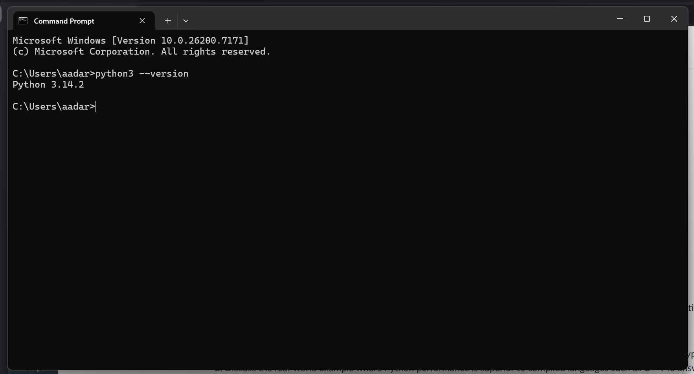

# Introduction to Python

## Questions
1. Create a two-column table; the first column stores the number of languages, and the second column stores the type of language (compiled, interpreted, or both).
2. Discuss the real-world example where Python performance is superior to compiled languages such as C++. To answer this question, you need to do some research.
3. Take a screenshot that shows that Python3 is installed successfully on your PC. The screenshot should show the installed Python version.
4. Take a screenshot that shows that the Github repository is all set up for this course.

## Answers
1. Table of **Programming Languages** and their type

2. 

3. Computer has Python3 installed

4. Image for having Github Repo ready for class

